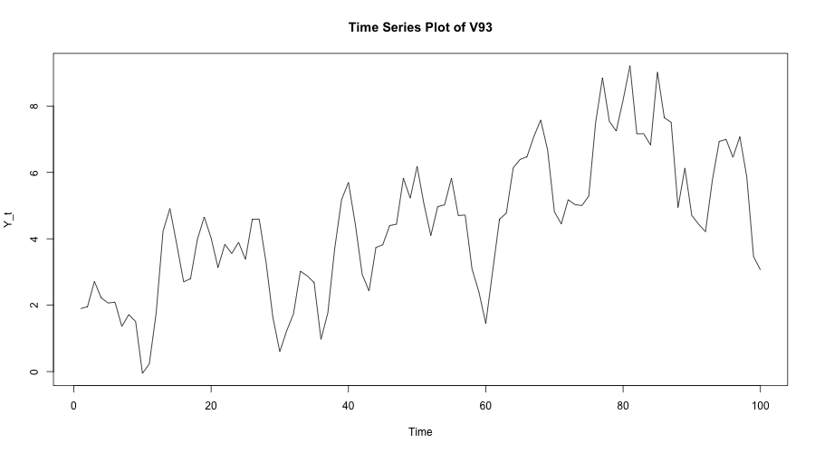
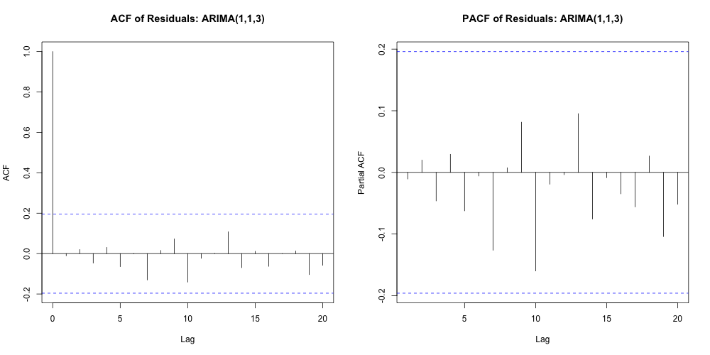
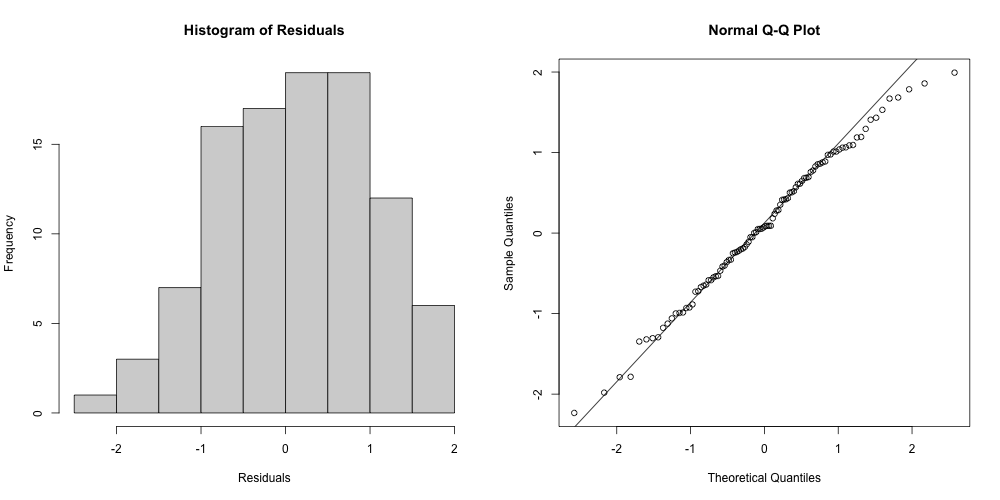
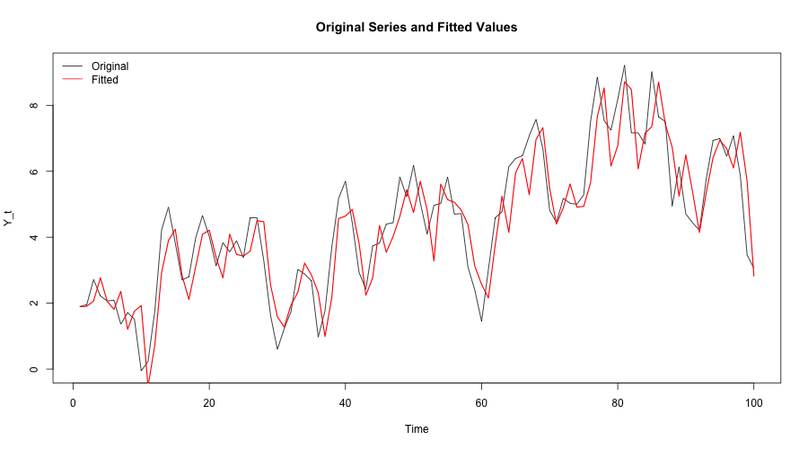
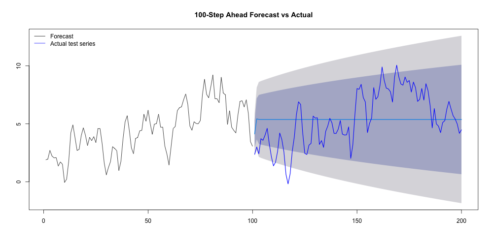

# Time Series Forecasting with ARIMA: 

This repository presents a complete univariate time series forecasting study using the ARIMA modeling framework. The project focuses on series **V93**, extracted from a multivariate time series dataset, and follows a full statistical forecasting workflow: exploratory analysis, stationarity assessment, ARIMA model selection, residual diagnostics, and out-of-sample forecast evaluation.

The objective is to identify a parsimonious ARIMA specification that adequately captures the temporal dependence structure of the series and provides reasonable forecasts for unseen observations.

---

## Project Overview

Time series forecasting requires both model fit and diagnostic validation. In this project, the first 100 observations of series V93 are used as the in-sample training period, while the remaining 100 observations are kept as an out-of-sample test set.

The analysis follows these steps:

1. Visual inspection of the time series  
2. Stationarity assessment using ACF plots and the Augmented Dickey-Fuller test  
3. ARIMA model estimation over a grid of candidate specifications  
4. Model selection using AIC and BIC  
5. Residual diagnostic checking using Ljung-Box, ACF/PACF, Q-Q plot, and Shapiro-Wilk test  
6. 100-step ahead forecasting and out-of-sample MSE evaluation  

---

## Repository Structure

```text
time-series-forecasting-arima/
├── code/
│   └── arima_analysis.R
├── data/
│   └── Case_study.csv
├── figures/
│   ├── series_plot.png
│   ├── differencing_acf.png
│   ├── acf_pacf_differenced.png
│   ├── residual_diagnostics.png
│   ├── residual_normality.png
│   ├── original_vs_fitted.png
│   └── forecast_vs_actual.png
├── results/
│   └── model_selection_results.csv
├── report/
│   └── time_series_forecasting_report.pdf
├── README.md
└── .gitignore
```

---

## Dataset

The dataset `Case_study.csv` contains multiple time series columns. This project analyzes only one assigned univariate series:

- **Series analyzed:** `V93`
- **Total observations:** 200
- **Training period:** first 100 observations
- **Test period:** last 100 observations

The modeling task is intentionally treated as a univariate forecasting problem, where future values are predicted using only the historical behavior of the selected series.

---

## Methodology

### 1. Preliminary Time Series Analysis

The original series was first plotted to inspect its overall behavior, level changes, and possible non-stationarity.



The series shows noticeable temporal dependence and gradual movement over time. To evaluate stationarity more formally, ACF plots were examined for the original series, first difference, and second difference.

The ACF of the original series showed persistent autocorrelation, while the differenced series displayed weaker dependence. Based on this, the ARIMA differencing order was set to:

\[
d = 1
\]

---

### 2. ARIMA Model Selection

A grid of ARIMA models was estimated using:

\[
ARIMA(p,1,q), \quad 1 \leq p \leq 4,\quad 1 \leq q \leq 4
\]

A total of 16 candidate models were compared using the Akaike Information Criterion (AIC) and Bayesian Information Criterion (BIC). The full model selection table is available in:

```text
results/model_selection_results.csv
```

The top three specifications were:

| Rank | Model | AIC | BIC |
|---:|---|---:|---:|
| 1 | ARIMA(1,1,3) | 274.89 | 287.87 |
| 2 | ARIMA(2,1,3) | 276.24 | 291.81 |
| 3 | ARIMA(1,1,4) | 276.72 | 292.29 |

Both AIC and BIC selected **ARIMA(1,1,3)** as the best-performing model. Since this model also uses fewer parameters than nearby alternatives, it was selected as the preferred specification.

---

## Selected Model

The final selected model is:

\[
ARIMA(1,1,3)
\]

The fitted model includes one autoregressive term and three moving-average terms after first differencing. Among the estimated coefficients, the third moving-average component was statistically important, suggesting that the model captures short-run shock effects in the differenced series.

---

## Residual Diagnostics

A forecasting model should leave residuals that are approximately uncorrelated and normally distributed. The selected ARIMA(1,1,3) model was evaluated using residual ACF/PACF plots, Ljung-Box testing, histogram, Q-Q plot, and Shapiro-Wilk testing.



The Ljung-Box test result for the selected model was:

| Test | Statistic | p-value |
|---|---:|---:|
| Ljung-Box test, lag 10 | 5.5659 | 0.8503 |

The high p-value indicates that there is no strong evidence of remaining autocorrelation in the residuals.

Normality was also assessed visually and statistically:



| Test | Statistic | p-value |
|---|---:|---:|
| Shapiro-Wilk test | 0.99067 | 0.7186 |

The Shapiro-Wilk p-value suggests that the residuals are approximately consistent with normality.

---

## Fitted Values

The selected model was compared against the in-sample observations to inspect how well it captures the structure of the training data.



The fitted values follow the main movements of the original series, indicating that the selected ARIMA specification captures much of the in-sample temporal structure.

---

## Forecasting Performance

The selected ARIMA(1,1,3) model was used to produce a 100-step ahead forecast. The forecast was compared with the held-out test observations.



The out-of-sample forecast accuracy was measured using Mean Squared Error:

\[
MSE = \frac{1}{n}\sum_{t=1}^{n}(y_t - \hat{y}_t)^2
\]

The resulting test-set MSE was:

| Model | Forecast horizon | Test MSE |
|---|---:|---:|
| ARIMA(1,1,3) | 100 steps | 5.235 |

---

## Key Findings

- The original series shows persistent autocorrelation, motivating the use of ARIMA modeling.
- First differencing was used to stabilize the series before ARMA model estimation.
- Among 16 candidate specifications, **ARIMA(1,1,3)** achieved the lowest AIC and BIC.
- Residual diagnostics showed no strong evidence of remaining autocorrelation.
- Residual normality checks were satisfactory based on the Q-Q plot and Shapiro-Wilk test.
- The final model achieved an out-of-sample MSE of **5.235** over a 100-step forecast horizon.

---

## Tools Used

- **R**
- `forecast`
- `tseries`
- `lmtest`
- Base R plotting functions

---

## How to Reproduce the Analysis

Clone the repository:

```bash
git clone https://github.com/Taanvir-Ahmed/time-series-forecasting-arima.git
cd time-series-forecasting-arima
```

Run the R script:

```r
source("code/arima_analysis.R")
```

The script reads the data from `data/Case_study.csv`, fits the candidate ARIMA models, saves figures to `figures/`, and writes the model comparison output to `results/`.

---

## Project Summary

This project demonstrates a complete ARIMA forecasting workflow, starting from exploratory analysis and stationarity assessment through model selection, residual diagnostics, and out-of-sample evaluation. The final selected model, **ARIMA(1,1,3)**, provides a statistically adequate and interpretable forecasting specification for series V93.